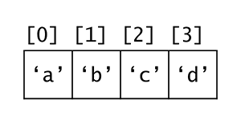

🚧 under contruction 🚧 

# Computer Science CheetSheet
a quick guide and study notes for basic algorithms, datastructure, and etc. basically, my summary of algorithms for core comp sci classes i tooked at the college.
Python is used for the example codes.


# Author
me. -- If you find any mistakes (syntax, logic, or grammar), criticisms are always welcomed! Feel free to reach out to me here: choikj0903@gmail.com


# Table of Content
* [Programming Basics](#programming-basics)
* [Data Structure](#data-structure)
  * [Data Structure Basics](#data-structure-basics)
  * [Array](#array--list)
  * [Linked List](#linked-list)
  * [Stack](#stack)
  * [Queue](#queue)
* [Algorithm Basics](#algorithm-basics)
* [Search Algorithms](#search-algorithms)
  * [Linear Search](#linear-search--sequential-search)
  * [Binary Search](#binary-search)


# Programming Basics


# Data Structure
## Data Structure Basics
***Data Structure*** is a way of organizing data in a computer efficiently. Different data structures are used according to the purpose so that a computer can effectively load and store data.

***Abstract Data Type (ADT)*** is a data type described by pre-defined using user operation such as "insert data at the rear". ***ADT*** only provides what operations are defined, not how the operations are implemented. For example, ***Stack*** is a ***abstract data type***. ***Stack*** is defined by ***push()*** which inserts an element at the top of the stack and ***pop()*** which gets top-most element out of the stack.


## Array / List
***Array*** stores data in sequential order. Each element can be accessed using an **index** usually starting from 0.

Time Complexity:
* Indexing: O(1)
* Search: O(n) / O(log n)


## Linked List
***Linked List*** is a series of entries that stores the value and a pointer to the next entry. Each entry is called ***Node***. Physical placement of the ***Nodes*** does not have to be sequential.

Time Complexity:
* Indexing: O(n)
* Append/Prepend: O(1)
* Delete: O(n)

***Singly Linked List***: each Node has only one pointer pointing to the next Node. Can only traverse in one direction.<br/>
***Doubly Linked List***: each Node has two pointers: one pointing to the next Node, another pointing to the previous Node. Can traverse in both directions.<br/>
***Circular Linked List***: "last" node of the list points to the "first" node of the list. Can traverse the list infinitely looping around the list.<br/>

[Implementation](implementation/linked-list.py)

[Getting middle element of a LinkedList with unknown length](implementation/middle-of-linked-list.py)

## Stack
**Stack** is an ADT that is described by Last-In-Fist-Out(LIFO) behavior. It can be implemented using both **Array** or **Linked List**
* ***push()***: insert an element at the top of the stack
* ***pop()***: return and remove an element at the top of the stack

[Implementation](implementation/stack.py)

[Tracking maximum of a stack](implementation/max-stack.py)


## Queue
**Queue** is an ADT that is described by First-In-First-Out(FIFO) behavior. It can be implemented using both **Array** or **Linked List**
* ***enque()***: insert an element at the end of the queue
* ***deque()***: return and remove an element at the head of queue

[Implementation](implementation/queue.py)


## HashTable / HashMap
***Hash table*** is a data structure that stores unordered items by mapping (or hashing) each item to a location in an array (or vector). It maps a unique ***key*** to an index using a ***hash function***. Each hash table array element is called ***bucket***. A common example of a ***hash function*** uses the modulo operator.

Time Complexity:
* Indexing: O(1)
* Search: O(1)
* Insert: O(1)

***Collision handling***: Collision occurs when a ***hash function*** returns the same outputs for distinct keys.
* ***Chaining***: a technique where each bucket has a list of items.
* ***Open Addressing***: a technique where collisions are resolved by looking for an empty bucket elsewhere in the table.
  * ***Linear Probing***: handles collision by linearly searching the bucket starting from the key's mapped bucket.
  * ***Quadratic Probing***: handles collision by quadratically searches the bucket starting frolm the key's mapped bucket. <br/>
       f(i) = (H + c1 * i + c2 * i<sup>2</sup>) % (*tablesize*), where H is the inital bucket, c1 and c2 is a programmer-defined constants.
  * ***Double hashing***: uses two hash functions to compute bucket indices. f(i)=(h1(key) + h2(key) * i) % (tablesize).
Iterating through a sequential *i* values to obtain the desired table is called ***probing sequence***.


## Tree

## Binary Tree

## Binary Search Tree

## Heap

## AVL Tree

## Graph


## Algorithm Basics
### Iterative Algorithm
An algorithm that performs number of steps repeatedly for a finite number of times. 
* Each repetition is called **iteration**.
* Uses looping statement like **for** and **while**.
* Mostly used to move through a data set like an array or a list. 


### Recursive Algorithm
An algorithm that calls itself.
* Recursive alorithm is divided into two parts: a **recursive case** and a **base case**.
* **Recursive case** is a condition where a recursion is triggered.
* **Base case** is a condition that stops the recursion and evaluates the result.
* Often used in Depth First Search


## Search Algorithms
### Linear Search / Sequential Search
A very simple searching algorithm. It starts from one end checking every element until the desired element is found.
* It can be performed in an unsorted list.
* Time Complexity : **O(n)**
```python
def LinearSearch(array, key):
  for i, elem in enumerate(array):
    if(array[i] == key):
      return i
      
  return -1
```


### Binary Search
A search algorithm that repeatedly divides the search interval in half until the desired element is found or the interval is empty.
* It can only be performed in a sorted list.
* Time Complexity : **O(log n)**
```python
def LinearSearch(array, key):
  left = 0
  right = len(array)
  mid = 0

  while left <= right:
    mid = (left+right) // 2

    if array[mid] < key:
      left = mid + 1
    
    elif array[mid] > key:
      right = mid - 1

    else:
      return mid

  return -1
 ```
  
