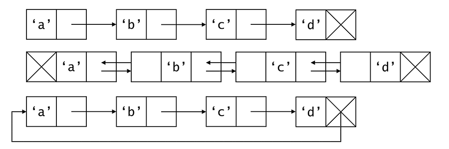
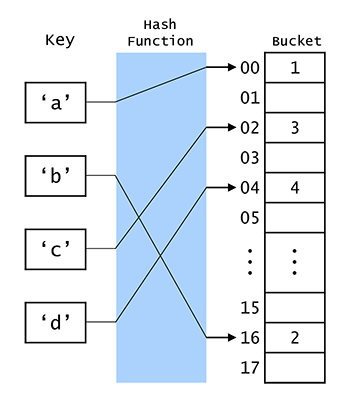
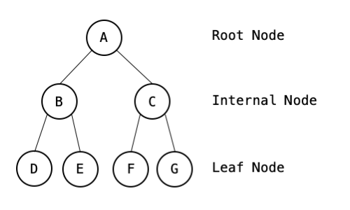
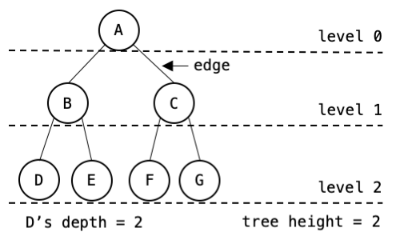
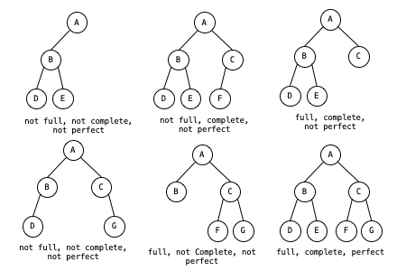
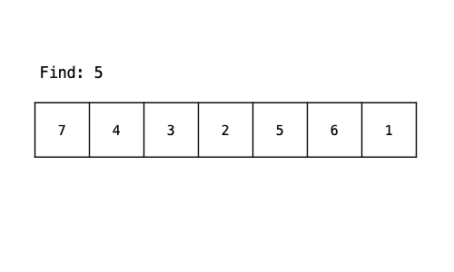
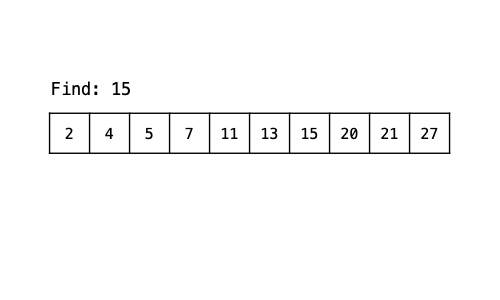
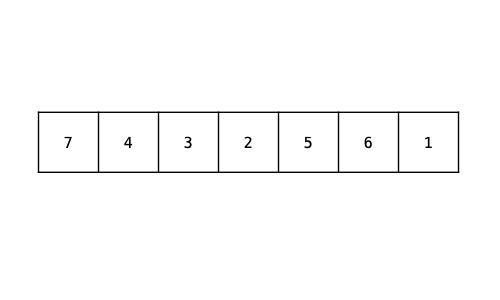
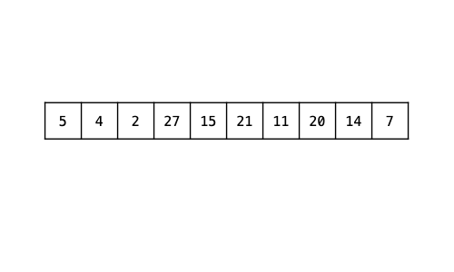
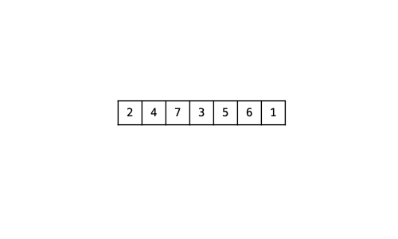

# ComputerScienceCheatSheet
a quick guide and study notes for basic algorithms, datastructure, and etc. basically, my summary for core comp sci classes i tooked at the college.
Python and Java is used for the example codes. 

[SEE FULL BLOG SERIES HERE](https://kwangjong.github.io/cscheatsheet)

# Author
me. all implementations and visual aids are made by me.
-- If you find any mistakes (syntax, logic, or grammar), criticisms are always welcomed! Feel free to reach out to me here: choikj0903@gmail.com

# Table of Content
* [Programming Basics](#programming-basics)
  * [Procedural Programming vs Object-Oriented Programming](#procedural-programming-vs-object-oriented-programming)
  * [Fundamentals of Object-Oriented Programming](#fundamentals-of-object-oriented-programming)
  * [Memory Regions](#memory-regions)
* [Data Structure Basics](#data-structure-basics)
  * [Array](#array--list)
  * [Linked List](#linked-list)
  * [Stack](#stack)
  * [Queue](#queue)
* [Tree](#tree)
  * [Binary Tree](#binary-tree)
  * [Binary Search Tree](#binary-search-tree)
* [Algorithm Basics](#algorithm-basics)
* [Search Algorithms](#search-algorithms)
  * [Linear Search](#linear-search--sequential-search)
  * [Binary Search](#binary-search)
* [Sorting Algorithms](#sorting-algorithms)
  * [Selection Sort](#selection-sort)
  * [Insertion Sort](#insertion-sort)
  * [Quick Sort](#quick-sort)
  * [Merge Sort](#merge-sort)

# Programming Basics
Collection of some basics in programming.

## Procedural Programming vs Object-Oriented Programming
### Procedural Programming
***Procedural Programming*** is a programming model that uses **top-down approach**. It is based upon the concept of calling **functions**. A function is also known as procedure, routine, or subroutine. The program follows step-by-step instructions provided by the functions. Examples of procedural programming languages are Cobol, Fortran, and C.

### Object-Oriented Programming
***Object-Oriented Programming*** is a programming model based upon the concept of **objects**. An **object** is a component of a program that consists of data called **attributes** and code called **methods**. The program relies on the interaction between objects or different components of the program to achieve its goal.

## Fundamentals of Object-Oriented Programming
There are four fundamental concepts of Object-Oriented Programming: **Encapsulation**, **Abstraction**, **Polymorphism**, and **Inheritance**.

### Encapsulation
***Encapsulation*** is a concept of bundling related variables and methods into an object. This restricts direct access to some of the object's components which protect them from being modified incorrectly. Refer to the diagram below.


Animal class bundles its attributes and actions into an object. It restricts direct read-and-write access to its attributes 'name' and 'food', but it is used during the execution of the class's methods.

### Abstraction
In Object-Oriented Programming, an object shows only essential elements. This property is called ***Abstraction***. ***Abstraction*** makes the interface of an object simpler. In the Animal class, method digest() and consume_food() are hidden. These methods are called inside other methods. Only public methods like eat() and walk() are visible to any external class. This allows more intuitive and simpler interface.

### Inheritance
***Inheritance*** is the procedure in which one class inherits the attributes and methods of another class. The class whose properties and methods are inherited is known as the **Parent class**. And the class that inherits the properties from the parent class is the **Child class**. In addition to the properties inherited by the **parent class**, **child class** can have additional methods and attributes. **Child class** can also override methods inherited from **parent class**.


Dog and Cat are children of Animal class. In addition to the methods inherited from Animal, Dog and Cat have new methods called woof() and meow().

### Polymorphism
***Polymorphism*** is a property where one entity can have many different forms. One example of polymorphism is **subtyping** or **subclassing**. Let's use Animal class and its child classes as an example. Dog and Cat have constructors with their name in string as the only argument. Code snippets below are written in Java.
```java
Animal[] animal = new Animal[2];
animal[0] = new Dog("Buddy");
animal[1] = new Cat("Kitty");

animal[0].get_name(); // prints "My name is Buddy"
animal[1].get_name(); // prints "My name is Kitty"
```
the array of animal accepts both Dog and Cat as its elements, because Dog and Cat are subtype of Animal.

**Overloading** is also an example of polymorphism. It allows multiple methods with varying arguments to have the same name. This helps programmers to implement methods that achieve the same goal with different arguments.
```java
public static void print_sum(int a, int b) {
  System.out.println(a + b);
}
public static void print_sum(int a, int b, int c) {
  System.out.println(a + b + c);
}
public static void print_sum(String a, String b){
  int a_int = Integer.parseInt(a);
  int b_int = Integer.parseInt(b);
  System.out.println(a_int + b_int);
}
```
```java
print_sum(1,2); // 3
print_sum(1,2,3); // 6
print_sum("1","2")); // 3
```
The goal of print_sum methods are printing the sum of given arguments. The code above achieves the goal with two interger arguments, three interger arugments, and two string arguments.

The last common example of **polymorphism** is **parametric polymorphism** or, in some languages, **generics**. Generics enables data types to be a parameter when defining a class. This allows data structures in Java's library to accept different data types.
```java
class List<T> {
    class Node<T> {
        T elem;
        Node<T> next;
    }
    Node<T> head;
    int length() { ... }
}
```

[Implementation](https://github.com/Kwangjong/CSCheatSheet/blob/main/implementation/OOP.java)

## Memory Regions
There are four different regions in a typical program's memory.

***Code***: the region where the instructions are stored.<br/>
***Static***: the region where static fields are allocated. The data in this region are allocated only once during the execution of the program.<br/>
***Stack***: a linear memory region where a function calls and its local variables are stored. It is allocated when the functions or methods are called and de-allocates when it returns. **Stack** expands downwards from high address to low address.<br/>
***Heap***: the memory region available for programmers to allocate and de-allocate freely. Data in the heap is accessible to all threads. When an object is created, the object is allocated in the **heap**, and the reference to the object is stored in the **stack**. **Heap** expands upwards from low address to high address. 


### Garbage Collection
When heap memory is handled poorly by the programmer, issues like out-of-memory or memory leaks can happen. Most high-level languages use an automatic memory management mechanism called ***Garbage Collection***. It searches for unused data in heap and de-allocates them.

To determine which unnecessary data for **Garbage Collector** to de-allocate, the program needs to keep track of which objects are being used. Programming languages like Java and Python use a technique called ***reference counting***. 
The program keeps track of the number of reference variables that are currently referring to an object. If the reference count is zero the object is considered **unreachable object** which is freed by the **garbage collector**.


## Data Structure Basics
***Data Structure*** is a way of organizing data in a computer efficiently. Different data structures are used according to the purpose so that a computer can effectively load and store data.

***Abstract Data Type (ADT)*** is a data type described by pre-defined using user operation such as "insert data at the rear". ***ADT*** only provides what operations are defined, not how the operations are implemented. For example, ***Stack*** is a ***abstract data type***. ***Stack*** is defined by ***push()*** which inserts an element at the top of the stack and ***pop()*** which gets top-most element out of the stack.


## Array / List
***Array*** stores data in sequential order. Each element can be accessed using an ***index*** usually starting from 0.


Time Complexity:
* Indexing: O(1)
* Search: O(n) / O(log n)


## Linked List
***Linked List*** is a series of entries that stores the value and a pointer to the next entry. Each entry is called ***Node***. Physical placement of the ***Nodes*** does not have to be sequential.

Time Complexity:
* Indexing: **O(n)**
* Append/Prepend: **O(1)**
* Delete: **O(n)**

[Implementation](implementation/linked-list.py)

[Getting middle element of a LinkedList with unknown length](implementation/middle-of-linked-list.py)

***Singly Linked List***: each Node has only one pointer pointing to the next Node. Can only traverse in one direction.<br/>
***Doubly Linked List***: each Node has two pointers: one pointing to the next Node, another pointing to the previous Node. Can traverse in both directions.<br/>
***Circular Linked List***: "last" node of the list points to the "first" node of the list. Can traverse the list infinitely looping around the list.<br/>




## Stack
***Stack*** is an ADT that is described by Last-In-Fist-Out(LIFO) behavior. It can be implemented using both ***Array*** or ***Linked List***
* ***push()***: insert an element at the top of the stack
* ***pop()***: return and remove an element at the top of the stack

[Implementation](implementation/stack.py)

[Tracking maximum of a stack](implementation/max-stack.py)


## Queue
***Queue*** is an ADT that is described by First-In-First-Out(FIFO) behavior. It can be implemented using both ***Array*** or ***Linked List***
* ***enque()***: insert an element at the end of the queue
* ***deque()***: return and remove an element at the head of queue

[Implementation](implementation/queue.py)


## HashTable / HashMap
***Hash table*** is a data structure that stores unordered items by mapping (or hashing) each item to a location in an array (or vector). It maps a unique ***key*** to an index using a ***hash function***. Each hash table array element is called ***bucket***. A common example of a ***hash function*** uses the modulo operator.



Time Complexity:
* Indexing: **O(1)**
* Search: **O(1)**
* Insert: **O(1)**

***Collision handling***: Collision occurs when a ***hash function*** returns the same outputs for distinct keys.
* ***Chaining***: a technique where each bucket has a list of items.
* ***Open Addressing***: a technique where collisions are resolved by looking for an empty bucket elsewhere in the table.
  * ***Linear Probing***: handles collision by linearly searching the bucket starting from the key's mapped bucket.
  * ***Quadratic Probing***: handles collision by quadratically searches the bucket starting frolm the key's mapped bucket. <br/>
       f(i) = (H + c1 * i + c2 * i<sup>2</sup>) % (*tablesize*), where H is the inital bucket, c1 and c2 is a programmer-defined constants.
  * ***Double hashing***: uses two hash functions to compute bucket indices. f(i)=(h1(key) + h2(key) * i) % (tablesize).
Iterating through a sequential *i* values to obtain the desired table is called ***probing sequence***.


## Tree
***Tree*** is an ADT that simulates hiearchial structure by a set of linked nodes. Each Node stores its value and sets of its "child" nodes.



* ***Parent and Child Node***: A link between the nodes in the tree are described with a parent-child relationship. If Node 'A' stores pointers to the Node 'B'. Node 'A' is a parent of Node 'B', and Node 'B' is a child of Node 'A'.
* ***Root***: A node with no parent. There can be only one root node in a tree.
* ***Leaf***: a tree node with no children.
* ***Internal node***: a node with at least one child.



* ***Edge***: a link from a node to a child
* ***Depth***: the number of edges from the root to the node
* ***Level***: all nodes with the same depth
* ***Height***: the largest depth of any node.


### Binary Tree
In ***Binary Tree***, each node can only have up to two child nodes (*left and right child*).
* A binary tree is ***full*** if every node contains 0 or 2 child nodes.
* A binary tree is ***complete*** if all level, except the last level, are full and all node in the last level are as far left as possible.
* A binary tree is ***perfect*** if all internal node have 2 child nodes and all leaf nodes are at the same level.



### Binary Search Tree
***Binary Search Tree*** is a special type if a binary tree that has an ordering property. All the keys of any nodes's left subtree are less than the node's key, and all the keys of any node's right subtree are greater than the node's key. This property can make searching a key in the tree fast.

Time complexity:
* Insert: **O(h)**, where h is height of BST.
* Delete: **O(h)**
* Searching: **O(h)**


<!---### Heap

### AVL Tree

### Red-Black BST

### B-trees

traversal
depth first search
-preorder, inorder, postorder
breath first search
-level-order

## Graph--->


## Algorithm Basics
### Iterative Algorithm
An algorithm that performs number of steps repeatedly for a finite number of times. 
* Each repetition is called ***iteration***.
* Uses looping statement like ***for*** and ***while***.
* Mostly used to move through a data set like an array or a list. 


### Recursive Algorithm
An algorithm that calls itself.
* Recursive alorithm is divided into two parts: a ***recursive case*** and a ***base case***.
* ***Recursive case*** is a condition where a recursion is triggered.
* ***Base case*** is a condition that stops the recursion and evaluates the result.
* Often used in Depth First Search


## Search Algorithms
### Linear Search / Sequential Search
A very simple searching algorithm. It starts from one end checking every element until the desired element is found.
* It can be performed in an unsorted list.
* Time Complexity : **O(n<sup>2</sup>)**




### Binary Search
A search algorithm that repeatedly divides the search interval in half until the desired element is found or the interval is empty.
* It can only be performed in a sorted list.
* Time Complexity : **O(log n)**

[Implementation](implementation/binary-search.py)


  
  
## Sorting Algorithms
### Selection Sort
***Selection Sort*** is a comparison based algorithms. It divides the list into a sorted part and an unsorted part, and repeatedly searches the unsorted part and "select" the smallest or greates element to move from the unsorted part to the end of the sorted part.
* Optimized for small lists (fewer than 10-20elements).
* It may require many comparisions for big lists.
* Time Complexity: **O(n<sup>2</sup>)**

[Implementation](implementation/selection-sort.py)




### Insertion Sort
***Insertion Sort*** is a comparision based algorithm that searches the sorted part for the next element in the unsorted list to be "inserted".
* Optimized for small lists (fewer than 10-20elements).
* It may require many comparisions for big lists.
* It may require lesser comparision compare to ***selection sort***. ***Insertion sort*** only scans as many as it need to place ith element, while **selection sort*** always scans all elements in the unsorted part. ***Insertion sort*** is typically very efficient for list that are "nearly sorted".
* Time Complexity: **O(n<sup>2</sup>)**

[Implementation](implementation/insertion-sort.py)


### Quick Sort
***Quick Sort*** is a divide and conquer algorithm that recursively partitions the input into low and high parts and sorts each of those parts. A ***pivot*** is any value within the array that divide the data into low and high parts. To partition the input, All values in the low partition are less than or equal to the pivot value, and alll the values in the high partition are greater than or equal to the pivot value. The values in each partition are not necessarily sorted.
* It is fast for the most cases. **O(n log n)**.
* However, if the pivot selected is the smallest or largest element, it results an uneven partitioning. If uneven partitioning happens at every level the runtime is **O(n<sup>2</sup>)**. This rarely happens.
* Time Complexity:
  * Average: **O(n log n)**
  * Worst: **O(n<sup>2</sup>)**

[Implementation](implementation/quick-sort.py)




### Merge Sort
***Merge Sort*** is a divide and conquer algorithm that divides a list into two halves, recursively sorts each half and merges the sorted halves. Recursive partitioning happens until only one element is in the partition.
* It requires additional memory during merging process.
* It is not highly affected by the distribution of the array given.
* Time Complexity: **O(n)**

[Implementation](implementation/merge-sort.py)


